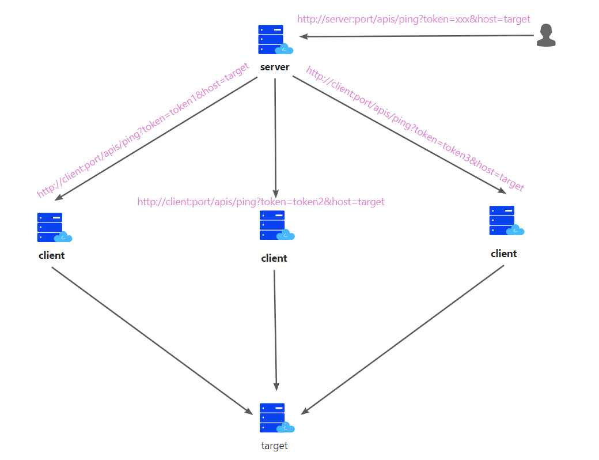

# checkCDN
## 简介
将被测试域名给server，server调用client，client解析被测试域名，server综合每个client的结果判断被测试域名是否使用cdn。

## 使用方法
### server

#### 编辑配置文件

```
//vim config/config.toml 
#server启动的服务
[app]
  debug = false
  host = "0.0.0.0"
  port = 8088
  #用户访问server的服务的认证信息
  token = "b947f276-e761-431f-928d-30ba93a397c1"

#server可以调用的client
[[client.infos]]
  host = "x.x.x.x"
  port = "80"
  #server调用client的认证信息
  token = "b947f276-e761-431f-928d-30ba93a397c1"
[[client.infos]]
  host = "x.x.x.x"
  port = "8087"
  token = "b947f276-e761-431f-928d-30ba93a397c1"
```
#### 启动server服务
```bigquery
//可执行程序server和config文件位于统一目录下
./server
```
#### 供用户使用接口
| Path | /apis/ping |
| ------ | ------ |
|Method|get|
|params|host(string,必须)|
|params|token(string,必须)
```bigquery
http://server:port/apis/ping?token=b947f276-e761-431f-928d-30ba93a397c1&host=www.baidu.com

{
  "code": 0,
  "msg": "success",
  "data": {
    "have_cdn": "Yes",
    "ip_addr": [
      "110.242.68.4",
      "103.235.46.40"
    ],
    "loss_rate": [
      "0%",
      "0%"
    ]
  }
}
```
### client

#### 编辑配置文件

```
//vim config/config.toml 
[app]
  #指定监听地址
  host = "0.0.0.0"
  #指定监听端口
  port = 8087
  #设置token
  token = "b947f276-e761-431f-928d-30ba93a397c1"
```
#### 启动client服务
```bigquery
//可执行程序clinet和config文件位于统一目录下
./clinet
```
#### 供server调用接口
| Path | /apis/ping |
| ------ | ------ |
|Method|get|
|params|host(string,必须)|
|params|token(string,必须)
```bigquery
http://client:port/apis/ping?host=www.baidu.com&token=b947f276-e761-431f-928d-30ba93a397c1


{
"code": 0,
"msg": "success",
"data": "\r\n正在 Ping www.baidu.com [39.156.66.18] 具有 32 字节的数据:\r\n来自 39.156.66.18 的回复: 字节=32 时间=19ms TTL=52\r\n\r\n39.156.66.18 的 Ping 统计信息:\r\n 数据包: 已发送 = 1，已接收 = 1，丢失 = 0 (0% 丢失)，\r\n往返行程的估计时间(以毫秒为单位):\r\n 最短 = 19ms，最长 = 19ms，平均 = 19ms\r\n"
}

```

